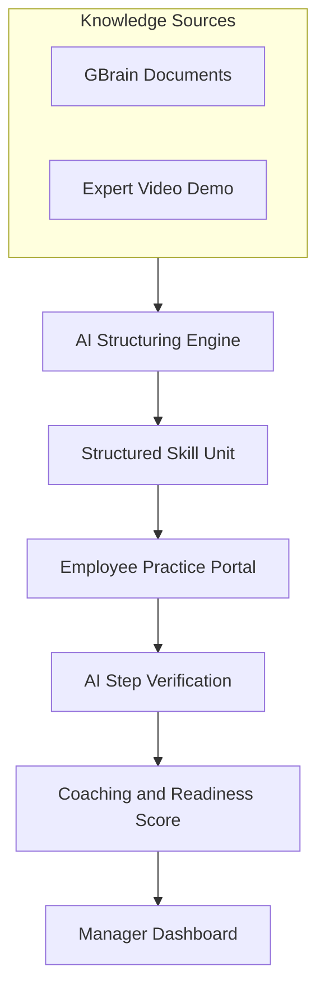
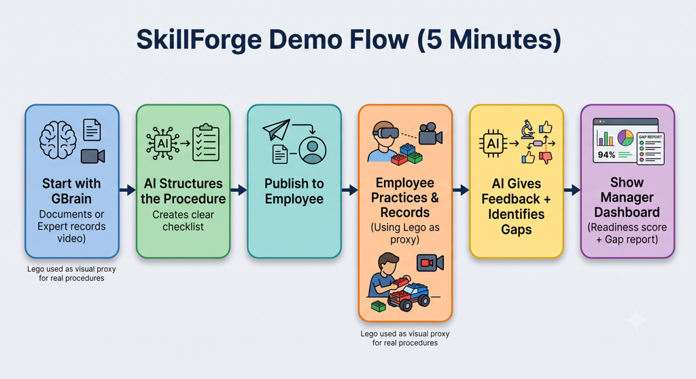
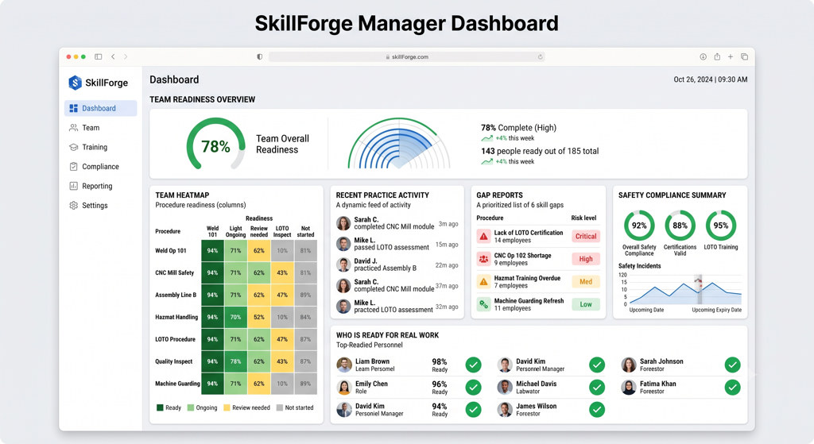

# SkillForge

**Turn company knowledge into executable skills.**

SkillForge is an AI-powered procedural execution platform that transforms company knowledge into structured, executable workflows. Instead of static documents that employees rarely read, SkillForge creates interactive skill units that can be practiced, verified, and measured.

The platform starts from existing company knowledge stored in GBrain or from expert demonstrations captured on video. AI converts this information into step-by-step procedures with success criteria, allowing employees to learn independently while managers gain real visibility into workforce readiness.

Today, SkillForge verifies human execution through AI coaching. In the future, the same structured procedures can power AI agents, robots, and automated systems.

## The Problem

Companies spend thousands of hours creating SOPs, manuals, and training documents. Most organizational knowledge suffers from several problems:

- Procedures remain trapped inside documents
- Critical knowledge exists only in experienced employees' heads
- Managers cannot easily measure whether employees are actually ready to perform a task
- Training requires experienced mentors and repeated supervision
- Organizations lack structured execution data that AI agents or robots can understand

Knowledge exists — but it isn't executable.

## Our Solution

SkillForge acts as an execution layer on top of GBrain. It transforms company knowledge into structured skill units that employees can practice independently with AI guidance, while giving organizations measurable insights into execution quality and readiness.

The same structured workflow can later be used by AI agents or physical robots, making today's training data tomorrow's automation foundation.

## How It Works



### Demo Flow

End-to-end demo in five minutes — from GBrain knowledge to manager readiness:



### Dual Knowledge Input

**Existing company documentation** — SOPs, manuals, PDFs, and internal docs stored in GBrain are converted into executable procedures.

**Expert demonstration** — When documentation doesn't exist, an expert performs the task on video. AI extracts the workflow and generates structured documentation automatically.

## Repository Layout

```
SkillForge/
├── apps/
│   ├── employee/     # Mobile-responsive practice portal
│   └── manager/      # Readiness analytics dashboard
├── packages/
│   └── shared/       # Skill unit schema, shared types, UI tokens
├── services/
│   └── api/          # GBrain sync, structuring, verification backend
└── docs/             # Architecture and integration documentation
```

| Package | Purpose |
|---------|---------|
| `apps/employee` | Mobile-responsive web portal for step-by-step practice with camera verification |
| `apps/manager` | Dashboard for team readiness, execution gaps, and compliance |
| `packages/shared` | Shared skill unit schema, types, and design tokens |
| `services/api` | Backend services: GBrain connector, AI structuring, CV verification |

## Tech Direction

| Layer | Technology |
|-------|------------|
| Knowledge source | GBrain API |
| Structuring | AI workflow extraction (documents and video) |
| Verification | Computer vision for step sequence and compliance |
| Employee portal | Mobile-responsive web application |
| Manager portal | Web analytics dashboard |

## Getting Started

```bash
git clone https://github.com/avinashkr29/SkillForge.git
cd SkillForge
```

### GBrain-first demo

```bash
# API + manager + employee portals
cd services/api
python3 -m venv .venv && source .venv/bin/activate
pip install -e ../../packages/shared/python -e .
uvicorn skillforge_api.main:app --reload --port 8000
```

- Manager: http://localhost:8000/manager — sync GBrain SOPs, assign skills, view gaps
- Employee: http://localhost:8000/employee — practice assigned procedures
- LEGO AR verifier: `cd services/cv-verification && python -m lego_ar`

See [docs/gstack-integration.md](docs/gstack-integration.md) for official [GBrain](https://github.com/garrytan/gbrain) + [GStack](https://github.com/garrytan/gstack) setup.

## Roadmap

| Phase | Deliverable | Status |
|-------|-------------|--------|
| 0 | Repo bootstrap, docs, monorepo skeleton | Complete |
| 1 | Skill unit JSON schema in `packages/shared` | Complete |
| 2 | GBrain connector in `services/api` | Complete (mock) |
| 3 | AI structuring pipeline (doc/video → skill unit) | Complete (rule-based) |
| 4 | Employee practice portal (LEGO demo) | Complete |
| 5 | Computer vision step verification | Complete |
| 6 | Manager readiness dashboard | Complete |

## Demo Scenario

SkillForge demonstrates end-to-end procedural execution using a LEGO assembly workflow. The process mirrors real manufacturing: AI generates the procedure, the employee follows instructions, AI verifies each step, errors are detected instantly, and readiness updates on the manager dashboard.

LEGO serves as a visual proxy for real-world assembly, safety, and operational procedures.

### Manager Dashboard

Managers get real-time visibility into team readiness, skill gaps, compliance, and who is ready for real work:



## License

MIT — see [LICENSE](LICENSE).