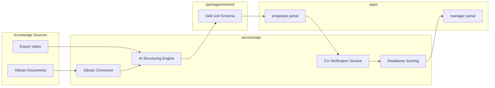

# SkillForge Architecture

## Overview

SkillForge is a dual-portal procedural execution platform built as a monorepo. It sits on top of GBrain as a knowledge source and adds an execution layer: structured skill units, AI-guided practice, computer vision verification, and manager-facing readiness analytics.

## System Diagram



## Core Data Primitive: Skill Unit

Every procedure in SkillForge is represented as a **skill unit** — a structured JSON document containing:

- Metadata (title, version, source, safety level)
- Ordered steps with instructions and success criteria
- Verification rules per step (sequence, visual checkpoints, compliance flags)
- Readiness scoring weights

The skill unit schema will live in `packages/shared` and be consumed by all apps and services.

## Dual-Portal Architecture

### Employee Portal (`apps/employee`)

- Mobile-responsive web application
- Displays step-by-step procedures from skill units
- Uses device camera for real-time execution verification
- Provides immediate coaching feedback (missed steps, incorrect actions, safety issues)
- Tracks individual practice sessions and readiness scores

### Manager Portal (`apps/manager`)

- Web analytics dashboard
- Individual and team readiness views
- Common execution gap identification
- Compliance status and training progress tracking
- Drill-down from team metrics to individual session history

## Knowledge Input Paths

### Path 1: GBrain Documents

```
GBrain API → GBrain Connector → AI Structuring Engine → Skill Unit
```

Existing SOPs, manuals, and PDFs are pulled from GBrain, parsed by the structuring engine, and converted into ordered procedural steps with success criteria.

### Path 2: Expert Video Demonstration

```
Video Upload → AI Structuring Engine → Skill Unit
```

When documentation doesn't exist, an expert records themselves performing the task. AI extracts the workflow sequence and auto-generates structured documentation.

## Backend Services (`services/api`)

| Service | Responsibility |
|---------|----------------|
| GBrain Connector | Authenticate, fetch documents, sync metadata |
| AI Structuring Engine | Convert documents/video into skill units |
| CV Verification | Analyze camera frames against step criteria |
| Readiness Scoring | Aggregate session results into readiness metrics |

## Monorepo Layout Rationale

| Directory | Why separate |
|-----------|-------------|
| `apps/employee` | Different UX constraints (mobile, camera, real-time feedback) |
| `apps/manager` | Different UX (analytics, charts, team views) |
| `packages/shared` | Single source of truth for skill unit schema and types |
| `services/api` | Backend logic shared by both portals, independent deploy cycle |

## Future Considerations

- **AI agents**: Skill units become executable procedures for digital workflow automation
- **Robotics**: Same structured steps can guide physical assembly robots
- **Human-robot collaboration**: Shared procedural language across humans and machines
- **Enterprise knowledge preservation**: Expert demonstrations captured as permanent, structured assets