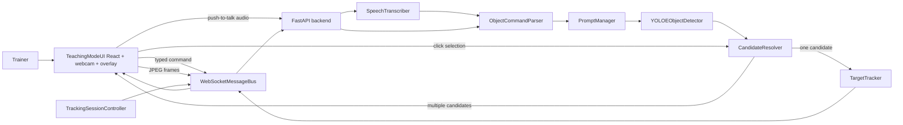

# Architecture

## Message Types

- `transcription.final`
- `command.parsed`
- `detection.candidates`
- `target.locked`
- `target.updated`
- `target.temporarily_lost`
- `target.lost`
- `session.state`
- `system.metrics`
- `error`
