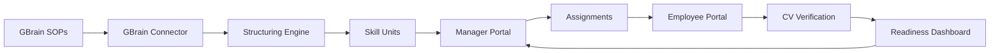

# G-Stack — GBrain-first PR stack for SkillForge

This stack implements SkillForge on top of GBrain in dependency order. Each layer builds on the previous one.

## Stack order

| PR | Branch | Scope | Depends on |
|----|--------|-------|------------|
| 1 | `gstack/01-shared-schema` | Skill unit JSON schema + Pydantic models | — |
| 2 | `gstack/02-gbrain-connector` | Mock GBrain connector + SOP documents | PR 1 |
| 3 | `gstack/03-structuring-engine` | GBrain doc → executable skill unit | PR 2 |
| 4 | `gstack/04-api-assignments` | FastAPI, assignments, readiness API | PR 3 |
| 5 | `gstack/05-manager-portal` | Manager UI (GBrain sync + assign) | PR 4 |
| 6 | `gstack/06-employee-portal` | Employee practice UI | PR 4 |
| 7 | `gstack/07-cv-verification` | OpenCV LEGO AR verifier | PR 3 |

## Data flow



## Push as a stack to GitHub

```bash
# From repo root — feature branch with full GBrain integration
git checkout -b feat/gbrain-integration
git add packages/shared services/api data/gbrain-mock apps/manager apps/employee docs/g-stack services/cv-verification
git commit -m "feat: GBrain-first integration with manager and employee portals"

git push -u origin feat/gbrain-integration
```

Open a PR from `feat/gbrain-integration` → `main` on https://github.com/avinashkr29/SkillForge