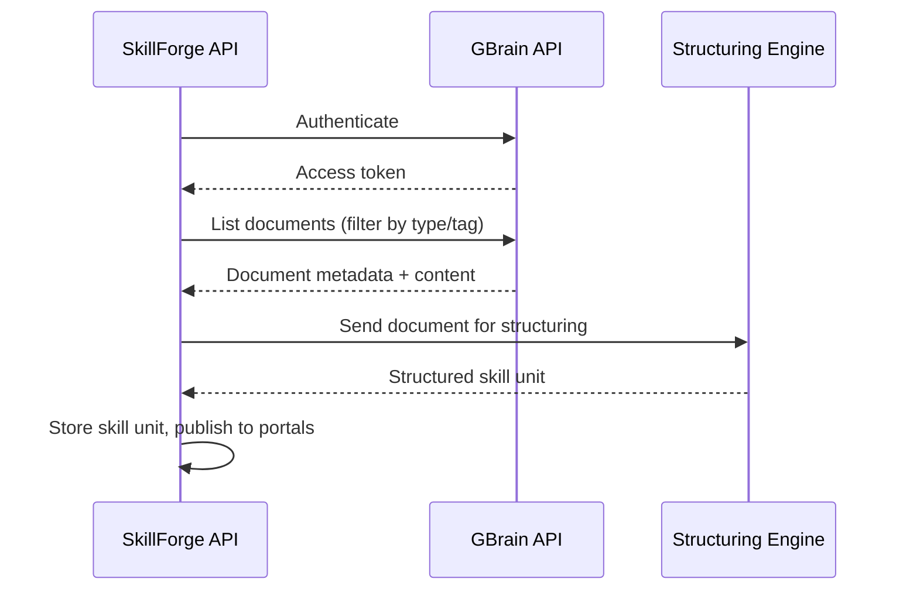

# GBrain Integration

## Overview

GBrain is SkillForge's primary knowledge source. The integration pulls existing company documentation (SOPs, manuals, PDFs) and feeds it into the AI structuring engine to produce executable skill units.

## Intended Sync Flow



## Authentication

> Status: Planned — approach TBD

Options under consideration:

- **API key** — Simple, suitable for server-to-server sync
- **OAuth 2.0** — If GBrain supports delegated access per organization

Credentials will be stored in environment variables (`GBRAIN_API_KEY` or OAuth client credentials). Never committed to the repository.

## Planned Endpoints

| Operation | Description |
|-----------|-------------|
| `listDocuments` | Fetch available SOPs, manuals, and training docs |
| `getDocument` | Retrieve full content of a single document |
| `syncDocument` | Pull a document and trigger structuring pipeline |
| `watchChanges` | Poll or webhook for new/updated documents |

Exact endpoint paths and request/response shapes will be documented here once the GBrain API contract is confirmed.

## Sample Skill Unit Output

Below is an example of what the structuring engine should produce from a GBrain document or expert video. This LEGO assembly demo mirrors a real manufacturing workflow.

```json
{
  "id": "skill-lego-assembly-001",
  "title": "LEGO Model Assembly",
  "version": "1.0.0",
  "source": {
    "type": "gbrain_document",
    "documentId": "gb-doc-12345",
    "title": "LEGO Assembly SOP v2"
  },
  "safetyLevel": "low",
  "estimatedDurationMinutes": 15,
  "steps": [
    {
      "order": 1,
      "title": "Sort pieces by color",
      "instruction": "Lay out all LEGO pieces on a flat surface, grouped by color.",
      "successCriteria": [
        "All pieces visible and separated by color group"
      ],
      "verification": {
        "type": "visual",
        "checkpoints": ["pieces_grouped_by_color"]
      }
    },
    {
      "order": 2,
      "title": "Build the base plate",
      "instruction": "Connect the 4x4 green base plate pieces to form the foundation.",
      "successCriteria": [
        "Base plate is flat and all connections are secure"
      ],
      "verification": {
        "type": "visual",
        "checkpoints": ["base_plate_assembled", "connections_secure"]
      }
    },
    {
      "order": 3,
      "title": "Attach walls",
      "instruction": "Snap wall bricks onto the base plate along all four edges.",
      "successCriteria": [
        "All four walls attached",
        "Walls are vertically aligned"
      ],
      "verification": {
        "type": "visual",
        "checkpoints": ["walls_attached", "walls_vertical"]
      }
    }
  ],
  "readinessWeights": {
    "sequenceCorrectness": 0.4,
    "stepCompletion": 0.3,
    "safetyCompliance": 0.2,
    "qualityScore": 0.1
  }
}
```

## Error Handling

| Scenario | Behavior |
|----------|----------|
| GBrain unreachable | Retry with exponential backoff; surface degraded mode in manager dashboard |
| Document parse failure | Log error, notify manager, skip document |
| Structuring timeout | Queue for retry; do not block other documents |
| Auth token expired | Refresh automatically; alert if refresh fails |

## Next Steps

1. Confirm GBrain API base URL, auth method, and available endpoints
2. Implement `GBrainConnector` in `services/api`
3. Define skill unit JSON schema in `packages/shared`
4. Wire connector output into the structuring engine