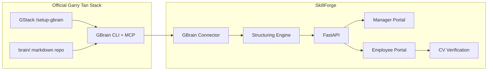

# GStack + GBrain Integration for SkillForge

SkillForge uses the **official** Garry Tan open-source tools — not a custom mock.

| Tool | Official repo | Role in SkillForge |
|------|---------------|-------------------|
| **GBrain** | [github.com/garrytan/gbrain](https://github.com/garrytan/gbrain) | Company knowledge source (SOPs, procedures) |
| **GStack** | [github.com/garrytan/gstack](https://github.com/garrytan/gstack) | Developer/agent setup to install, sync, and query GBrain |

## Architecture



**GBrain** holds manufacturing SOPs in `brain/manufacturing/`.  
**SkillForge** reads those pages and converts them into executable skill units for employees.

## One-time setup (official GStack path)

### 1. Install GStack skills (Claude Code / Cursor)

Follow [Garry Tan's AI coding setup](https://www.ycombinator.com/library/OW-inside-garry-tan-s-ai-coding-setup) and install GStack from [github.com/garrytan/gstack](https://github.com/garrytan/gstack).

### 2. Run `/setup-gbrain`

In your coding agent with GStack installed:

```
/setup-gbrain
```

Pick **Path 3: PGLite local** for fastest try-it-first setup, or Supabase for team sharing.  
Full guide: [USING_GBRAIN_WITH_GSTACK.md](https://github.com/garrytan/gstack/blob/main/USING_GBRAIN_WITH_GSTACK.md)

### 3. Index SkillForge brain pages

```bash
cd SkillForge
gbrain import brain/
gbrain search "product 2 assembly"
```

### 4. Keep brain indexed (GStack)

```
/sync-gbrain
```

This registers the repo as a federated source and syncs code + memory per GStack conventions.

## SkillForge connector modes

The API auto-detects how to read GBrain:

| Mode | When | Source |
|------|------|--------|
| `gbrain-cli` | Official `gbrain` installed and healthy | `gbrain get manufacturing/...` |
| `brain-filesystem` | `brain/manufacturing/*.md` exists | Direct markdown read |
| `mock-fallback` | No brain repo (legacy) | `data/gbrain-mock/` |

Check live mode:

```bash
curl http://localhost:8000/api/gbrain/status
```

Force a mode:

```bash
export GBRAIN_CONNECTOR_MODE=filesystem   # or cli | mock
```

## Manager → Employee flow

1. **Manager** opens http://localhost:8000/manager
2. Syncs GBrain documents → SkillForge skill units
3. Assigns Product 1 / Product 2 training to employees
4. **Employee** opens http://localhost:8000/employee, practices steps
5. **CV verifier** uses exported instructions from `/api/skills/{id}/instructions.txt`
6. Readiness updates on manager dashboard

## References

- [GBrain GitHub](https://github.com/garrytan/gbrain)
- [GStack GitHub](https://github.com/garrytan/gstack)
- [Using GBrain with GStack](https://github.com/garrytan/gstack/blob/main/USING_GBRAIN_WITH_GSTACK.md)
- [What is GBrain (overview)](https://vectorize.io/articles/what-is-gbrain)
- [YC: Inside Garry Tan's AI coding setup](https://www.ycombinator.com/library/OW-inside-garry-tan-s-ai-coding-setup)